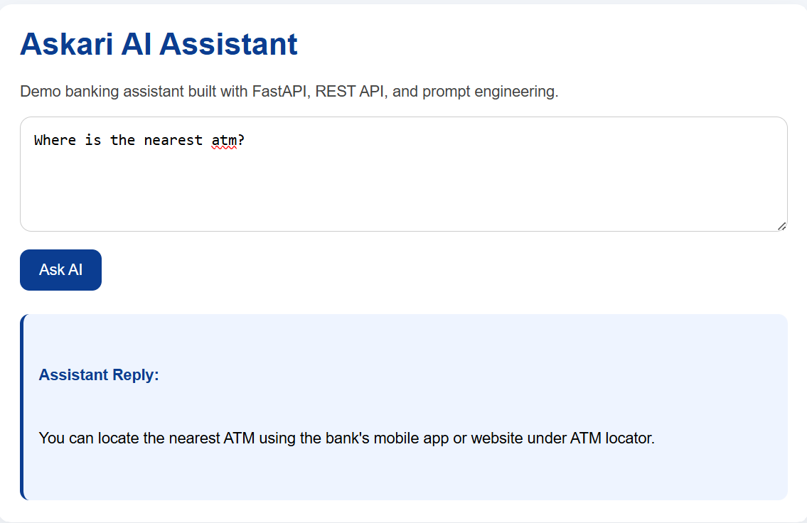

# Askari AI Assistant
## Preview


AI-powered banking assistant built with FastAPI and Gemini API, demonstrating prompt engineering, REST APIs, and intelligent query handling.

## Features
- Banking-focused AI assistant for common customer queries
- FastAPI backend with REST endpoints
- Gemini API integration
- Prompt-engineered safe responses
- Rule-based handling for selected banking queries
- Simple web interface for live testing

## Tech Stack
- Python
- FastAPI
- Gemini API
- HTML/CSS
- dotenv

## Project Structure
```text
askari-ai-assistant/
├── app/
│   ├── __init__.py
│   ├── main.py
│   └── prompts.py
├── static/
│   └── index.html
├── screenshots/
├── .gitignore
└── README.md
Run Locally
Clone the repo
Create and activate a virtual environment
Install dependencies
Add your Gemini API key in a .env file
Start the server
pip install fastapi "fastapi[standard]" python-dotenv google-genai
fastapi dev app/main.py

Then open:

http://127.0.0.1:8000
Sample Queries
How can I open a savings account?
What are your branch timings?
How can I find the nearest ATM?
What should I do if I suspect fraud on my account?
Note

This is a demo banking assistant built for learning and portfolio purposes. It does not perform real banking transactions.


Then push it:

```powershell
git add README.md
git commit -m "Add README"
git push

